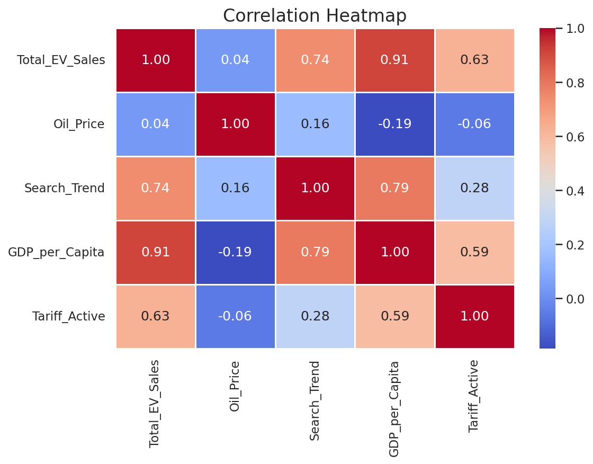
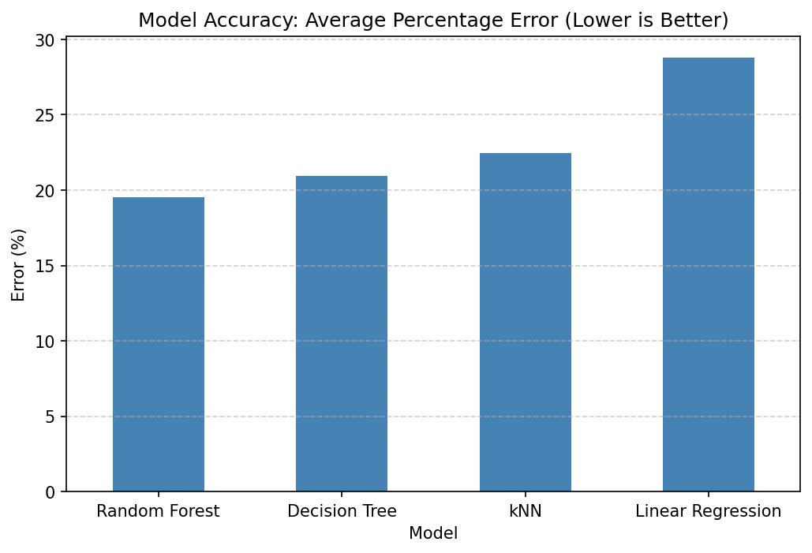
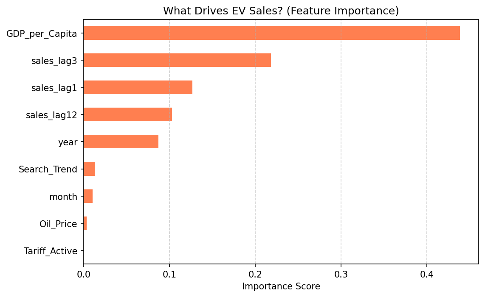

# Analysis of EV Sales in the US
## Motivation 
Growing global energy crises, geopolitical conflicts, and fluctuations in oil prices have significantly affected the transportation and energy sectors in recent years. As someone who has always been interested in cars and automotive technologies, I became curious about whether rising oil prices are actually encouraging people to adopt electric vehicles (EVs), or whether the relationship is weaker than commonly assumed.

This project aims to investigate the relationship between oil prices and EV adoption in the United States by combining economic indicators, income data, and Google search trends. I chose to focus specifically on the U.S. because of the availability of reliable and comprehensive datasets, as well as the ability to better control external factors that may influence consumer behavior.

Through this analysis, I hope to better understand how modern energy and oil crises influence consumer decisions regarding electric vehicle purchases.

## Data Collection and Sources

To collect electric vehicle sales data in the United States, I conducted several Google searches and found EV sales reports published by Argonne National Laboratory. The dataset was provided in PDF format and categorized into different classes of electric vehicles. For this project, I specifically used BEV (Battery Electric Vehicle) and PHEV (Plug-in Hybrid Electric Vehicle) sales data. For oil price data, I used a Python library connected to Yahoo Finance to access historical market data. GDP data was collected separately from FRED through Python as well. In addition, I used Google Trends to collect public interest data by analyzing how frequently the term “electric car” was searched over time. Finally, based on the feedback I received on my project proposal, I added a dummy variable to separate the periods before and after the tariffs imposed by the United States on Chinese electric vehicles. This allowed me to examine whether the policy change had any measurable effect on EV sales behavior.

This project integrates multiple heterogeneous datasets covering **2010–2026**, aligned temporally into a monthly format:

**1. US EV Sales (BEV + PHEV):** Source is Argonne National Laboratory for the Total EV Sales (Battery Electric + Plug-in Hybrid)

**2. Crude Oil Prices (WTI):** Source is Yahoo Finance API (`yfinance`) to find the monthly closing prices for WTI Crude Oil.

**3. US GDP per Capita:** Source is Federal Reserve Economic Data (FRED - A939RX0Q048SBEA), to represent consumer purchasing power and economic health.

**4. Public Interest (Google Trends)** Source is Google Trends and the the keywords that is searched: "electric car" (US Region)

**5. US Tariff Policy: ** Source is US Policy Announcements and it represented as binary dummy variable — 1 after May 2024 (100% tariff on Chinese EV imports).
---

## Detailed Analysis & Code

All data collection, exploratory data analysis, hypothesis testing, and machine learning models are fully documented in the notebooks.

### Data Analysis Pipeline

**1. Data Preparation**
- Formatted various date strings into standardised `datetime` objects.
- Merged four disparate data sources into a single temporal DataFrame.
- Applied **Min-Max Normalisation** (0–1) to allow fair comparison across scales.
- Engineered a binary `Tariff_Active` feature for chronological policy tracking.

**2. Exploratory Data Analysis (EDA)**
- Overlaid time-series plots comparing normalised sales, oil prices, and search trends.
- Pearson correlation heatmaps across all features.
- Box-plots to evaluate EV sales distributions before and after the May 2024 tariffs.

---

## Hypothesis Testing

Evaluated using **Pearson Correlation** and **Welch's Independent T-Tests** (α = 0.05):

| Hypothesis | Description | Result |
|:---|:---|:---|
| **H1** | Higher GDP per Capita correlates with higher EV sales. | **Confirmed** (r = 0.916, p < 0.001) |
| **H2** | Increased Google Search volume correlates with higher sales. | **Confirmed** (r = 0.734, p < 0.001) |
| **H3** | High oil prices drive EV sales. | **Rejected** (p = 0.59) |
| **H4** | Mean EV sales differ significantly after the May 2024 tariffs. | **Confirmed** (Sales significantly higher post-tariff, p < 0.001) |

### Visualizing the Hypothesis (Correlation Heatmap)
To visually confirm relationships between variables (such as GDP and EV Sales), we generated a correlation heatmap:


---

## Machine Learning Models

Four regression models were implemented to predict US EV sales: Linear Regression, k-Nearest Neighbors (kNN), Random Forest, and Decision Tree.

The dataset was enriched with **Feature Engineering** — adding historical sales momentum (`sales_lag1`, `sales_lag3`, `sales_lag12`) and temporal dynamics (`month`, `year`).

### Model Setup
- **Split:** Chronological — Training: Jan 2011 → May 2024 | Testing: Jun 2024 → 2026
- **Scaling:** `MinMaxScaler` fitted on training data only (no look-ahead bias)
- **Evaluation Metrics:** RMSE, MAE, R², and MAPE

---

## Results Summary

All four models were ranked across every metric. **Random Forest** is the clear winner on all measures:

Below are the visual comparisons of the models' accuracy and the key drivers behind the Random Forest predictions. (From `Machine_Learning_Modeling.ipynb`)

**1. Model Accuracy (MAPE)**


 **MAPE** gives an intuitive percentage error of the model.
 
**2. Feature Importance (Random Forest)**


---

## Results & Interpretation

- **The Time-Series Breakthrough:** Adding historical sales lags resolved the "extrapolation flatline" in tree models. Random Forest went from negative R² to **+0.10**, and MAPE dropped below 20%.

- **Best Model:** **Random Forest** — lowest error on all metrics. Its ensemble approach handles non-linear interactions between sales momentum, seasonality, and tariff effects better than a single tree.

- **Momentum Over Macroeconomics:** Models only achieved positive accuracy after being given lag features. In a rapidly shifting market, **recent consumer momentum is a stronger short-term predictor than GDP or oil prices**.

- **The Post-Tariff Structural Break:** The remaining ~20% MAPE reflects market "X-factors" not yet in the model: localised policy incentives (Inflation Reduction Act), new model launches, and sudden tariff implementations.

---

## Limitations & Future Work

- GDP data is quarterly; linear interpolation introduces artificial smoothness.
- No hyperparameter tuning yet — Grid Search on Random Forest could reduce MAPE further.
- Native time-series algorithms (SARIMA, Prophet) have not been evaluated.
- Precise monthly policy data (e.g., federal tax credits claimed per month) could explain the residual error.

---

## Project Structure

```text
US_EV_Sales_Analysis/
├── Data collection, EDA and HypothesisTests/
│   ├── ev_sales.csv
│   ├── multiTimeline.csv
│   └── Data_collection_EDA_HypothesisTests.ipynb
├── Machine Learning Modeling/
│   ├── ev_sales.csv
│   ├── multiTimeline.csv
│   └── Machine_Learning_Modeling.ipynb
├── Raw data/
│   └── Total Sales for Website_February 2026.pdf
├── DSA210 Proposal Document.pdf
├── README.md
├── C1.png
├── C2.png
├── heatmap.png
└── requirements.txt

